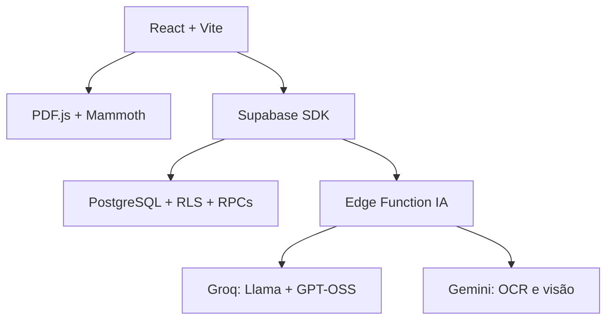

# Plataforma de Estudos

Aplicação web pessoal para organizar cronogramas, tarefas, matérias, questões, notas em blocos, datas importantes e análises comparativas de provas.

## Estado atual

Esta versão inclui:

- autenticação pelo Supabase;
- cronogramas em lista, Kanban, calendário e timeline;
- criação, importação, duplicação e reorganização atômicas;
- perguntas de múltipla escolha, verdadeiro/falso e dissertativas;
- upload simultâneo de até 20 provas PDF, DOCX, TXT, Markdown ou imagem;
- extração local, OCR/leitura visual seletiva, classificação híbrida em lotes e cruzamento de assuntos;
- combinação de questões, trechos extraídos e conteúdos complementares de uma ou várias provas;
- persistência de documentos, questões classificadas e frequências;
- geração automática de cronograma com prioridade baseada na recorrência;
- notas hierárquicas em blocos;
- RLS, integridade multiusuário, testes, lint, CI e carregamento por rota.

PDFs digitalizados e imagens usam OCR nativo do Gemini. PDFs com texto permanecem no navegador e somente
questões que citam gráfico, tabela, mapa ou figura são enviadas para leitura visual.

## Arquitetura



- O navegador extrai e segmenta os documentos.
- A Edge Function alterna lotes entre os modelos da Groq e mantém as chaves privadas no servidor.
- O Gemini recebe somente arquivos que precisam de OCR ou interpretação visual; o arquivo temporário é removido após a resposta.
- Operações com várias inserções são executadas por funções PostgreSQL transacionais.
- O frontend nunca escolhe o `user_id` usado pelas RPCs; ele é obtido de `auth.uid()`.

## Requisitos

- Node.js 20.19+ ou 22.12+
- npm 10+
- projeto Supabase
- Supabase CLI para aplicar migrações e publicar a função
- chaves gratuitas da Groq e do Google AI Studio para as funções de IA

## Instalação

```bash
npm ci
cp .env.example .env
```

Preencha:

```env
VITE_SUPABASE_URL=https://SEU_PROJETO.supabase.co
VITE_SUPABASE_ANON_KEY=SUA_CHAVE_ANON_PUBLIC
```

Nunca coloque `service_role`, `GROQ_API_KEY`, `GEMINI_API_KEY` ou qualquer chave privada no `.env` do frontend.

## Banco de dados

Faça backup do banco antes de atualizar uma instalação existente.

```bash
supabase link --project-ref SEU_PROJECT_REF
supabase db push
```

As migrações são executadas em ordem:

1. `202608100001_schema_hardened.sql`: tabelas, migração dos campos antigos, constraints, chaves, índices, triggers, RLS e views seguras.
2. `202608100002_transactional_rpcs.sql`: funções transacionais usadas pelo frontend.

O primeiro arquivo copia `data_alvo` para `data_final` e `ritmo_horas_dia` para `horas_por_dia` antes de remover as colunas antigas. Se encontrar relações pertencentes a usuários diferentes, a migração para com uma mensagem em vez de alterar silenciosamente os dados.

Consulte [docs/SUPABASE.md](docs/SUPABASE.md) antes de aplicar em produção.

## Edge Function

Configure os segredos e publique:

```bash
supabase secrets set GROQ_API_KEY=SUA_CHAVE
supabase secrets set GEMINI_API_KEY=SUA_CHAVE
supabase secrets set GROQ_LLAMA_MODEL=llama-3.1-8b-instant
supabase secrets set GROQ_GPT_OSS_MODEL=openai/gpt-oss-20b
supabase secrets set GEMINI_MODEL=gemini-3.5-flash-lite
supabase secrets set ALLOWED_ORIGINS=https://seu-dominio.com
supabase functions deploy ia
```

`llama-3.1-8b-instant` está programado para ser desativado pela Groq em 16/08/2026. O código já tenta
`openai/gpt-oss-20b` automaticamente quando o Llama falha, portanto a aplicação continua funcionando.

`ALLOWED_ORIGINS` aceita uma lista separada por vírgulas. A verificação JWT permanece habilitada.

## Desenvolvimento

```bash
npm run dev
```

Verificações disponíveis:

```bash
npm run lint
npm run test
npm run build
npm run check
```

## Análise de provas

1. Cadastre matérias e assuntos para melhorar a correspondência por IDs.
2. Abra **Analisar múltiplas provas**.
3. Envie de 1 a 20 arquivos, com até 25 MB cada. Novos envios são adicionados aos anteriores e arquivos duplicados são ignorados pelo hash.
4. Marque os arquivos que deverão participar da análise.
5. Abra **Revisar e escolher conteúdos** em cada arquivo.
6. Marque uma ou várias questões/trechos, edite o texto quando necessário ou use **Adicionar conteúdo**.
7. Clique em **Classificar seleção com IA**.
8. Confira a tabela cruzada de matéria, assunto, arquivos e frequência.
9. Clique em **Salvar conteúdos selecionados**.
10. Informe início, fim e horas por dia para gerar o cronograma.

Quando a numeração das questões não é reconhecida, o texto é dividido automaticamente em trechos selecionáveis de até 3.000 caracteres. Somente os arquivos e conteúdos escolhidos são enviados para classificação e persistidos na análise; conteúdos desmarcados não influenciam a frequência nem o cronograma.

O peso usado na priorização combina quantidade de questões e presença em documentos diferentes. Assim, repetição dentro de uma única prova não vale o mesmo que recorrência em várias provas.

## Segurança

- Todas as 13 tabelas de usuário usam RLS forçado.
- As views utilizam `security_invoker=true`.
- Relações obrigatórias usam chaves compostas com `user_id`.
- Relações opcionais são verificadas por trigger.
- RPCs ignoram `user_id` enviado pelo cliente.
- A Edge Function limita origem, tamanho, timeout, lote e tokens.
- Erros do provedor não são devolvidos integralmente ao navegador.

## Estrutura

```text
src/
  components/          componentes e modais
  lib/                 extração, segmentação, IA, transações e testes
  pages/               páginas carregadas sob demanda
supabase/
  functions/ia/        única Edge Function canônica
  migrations/          schema e RPCs versionados
docs/                  arquitetura e implantação
```

## Deploy

O workflow em `.github/workflows/deploy.yml` executa lint, testes e build antes do GitHub Pages. Cadastre os secrets `VITE_SUPABASE_URL` e `VITE_SUPABASE_ANON_KEY` no GitHub.

O `base` do Vite está configurado como `/plataforma-estudos/`. Ajuste `vite.config.js` caso o nome do repositório ou o domínio seja diferente.

## Limitações conhecidas

- A classificação depende da disponibilidade e da cota do provedor de IA.
- Se a cota gratuita do Gemini acabar, PDFs com texto continuam funcionando; PDFs escaneados ficam pendentes até a cota voltar.
- A leitura visual é uma interpretação automática e deve ser revisada quando a classificação vier com confiança baixa.
- A migração precisa ser validada em um projeto Supabase de homologação antes de ser aplicada ao banco principal.
