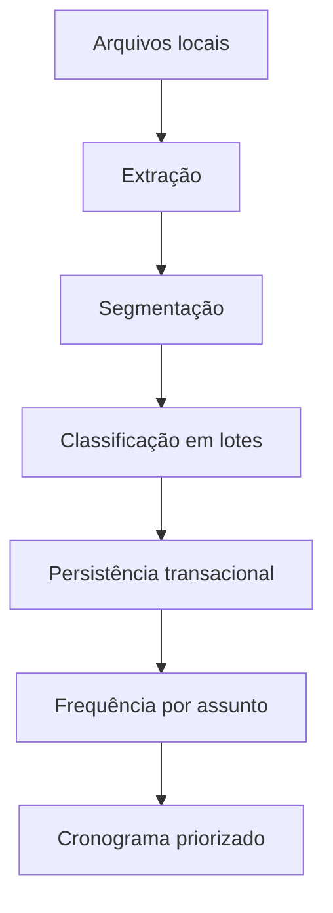

# Arquitetura técnica

## Camadas

- **Interface:** React 18, React Router e CSS responsivo.
- **Processamento local:** PDF.js para PDF, Mammoth para DOCX e regras determinísticas de segmentação.
- **Dados:** Supabase JS acessando PostgreSQL sob RLS.
- **Transações:** RPCs PL/pgSQL para operações compostas.
- **IA:** Edge Function Deno autenticada, com chamadas server-side à Groq.

## Pipeline de provas

Os arquivos originais não são enviados à IA. A classificação recebe somente o texto necessário de cada questão, limitado por tamanho e agrupado em lotes.

## Modelo de dados novo

`analises_provas` possui muitos `documentos_prova`; cada documento possui muitas `questoes_extraidas`; as frequências agregadas ficam em `frequencias_assuntos`. Um `cronograma` pode referenciar a análise que o originou.

## Decisões de segurança

- IDs de usuário não são aceitos como argumento nas RPCs.
- FKs compostas impedem relações obrigatórias entre proprietários diferentes.
- Triggers validam relações opcionais.
- Views executam com permissões do chamador.
- Políticas são limitadas ao papel `authenticated`.
- Respostas de erro externas são reduzidas a mensagens controladas e um `requestId`.

## Divisão do frontend

As páginas são carregadas com `React.lazy`. PDF.js e Mammoth só entram no fluxo quando a rota de provas é aberta, reduzindo o JavaScript inicial.
