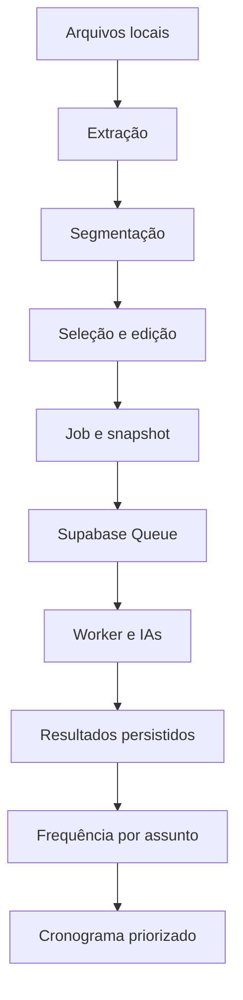

# Arquitetura técnica

## Camadas

- **Interface:** React 18, React Router e CSS responsivo.
- **Processamento local:** PDF.js para PDF, Mammoth para DOCX e regras determinísticas de segmentação.
- **Dados:** Supabase JS acessando PostgreSQL sob RLS.
- **Transações:** RPCs PL/pgSQL para operações compostas.
- **Fila:** Supabase Queues/pgmq com mensagens duráveis e visibility timeout.
- **IA:** Edge Functions Deno autenticadas; Gemini como base e Groq como acelerador opcional.

## Pipeline de provas

Os arquivos originais não são enviados à classificação textual. O usuário escolhe arquivos e conteúdos individualmente. Questões reconhecidas, trechos automáticos e conteúdos complementares usam a mesma estrutura. A fila recebe somente o texto selecionado, limitado por tamanho e agrupado em lotes. PDFs digitalizados e elementos visuais continuam sendo enviados ao Gemini quando necessário.

`analise-worker` grava cada lote antes de removê-lo da queue. Rate limits produzem uma nova mensagem com atraso; encerramentos inesperados são recuperados pelo visibility timeout e pelo cron. Jobs a partir de 800 conteúdos usam Batch no modo automático. Resultados visuais ou com confiança abaixo de 0,62 são refinados pelo Flash.

## Modelo de dados novo

`analises_provas` possui muitos `documentos_prova`; cada documento possui muitas `questoes_extraidas`; as frequências agregadas ficam em `frequencias_assuntos`. Um `cronograma` pode referenciar a análise que o originou.

`analise_jobs` guarda dono, modo, snapshot, estado e contadores. `analise_lotes` guarda payload, tentativas, provedor, modelo e resultado de cada unidade de trabalho. As tabelas da extensão `pgmq` não são expostas ao frontend.

## Decisões de segurança

- IDs de usuário não são aceitos como argumento nas RPCs.
- FKs compostas impedem relações obrigatórias entre proprietários diferentes.
- Triggers validam relações opcionais.
- Views executam com permissões do chamador.
- Políticas são limitadas ao papel `authenticated`.
- Respostas de erro externas são reduzidas a mensagens controladas e um `requestId`.

## Divisão do frontend

As páginas são carregadas com `React.lazy`. PDF.js e Mammoth só entram no fluxo quando a rota de provas é aberta, reduzindo o JavaScript inicial.
